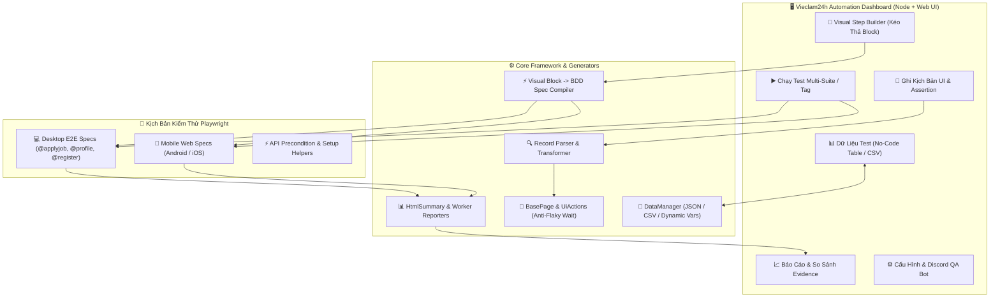

# 🚀 MASTER AUTOMATION IMPLEMENTATION PLAN — VIECLAM24H PLAYWRIGHT FRAMEWORK

Tài liệu này là **Bản Kế Hoạch Triển Khai Tổng Thể (Master Implementation Plan)** cho dự án **Automation Test Vieclam24h** (`D:\_Automation-Project`), nhằm mục tiêu xây dựng một nền tảng kiểm thử tự động toàn diện, dễ dùng cho cả **Manual QA / BA (Non-Tech Users)** lẫn **Automation Engineers**.

---

## 📊 1. Bảng Ma Trận Lộ Trình Triển Khai (Implementation Matrix)

| Giai Đoạn | Tên Kế Hoạch | Phạm Vi & Tính Năng Trọng Tâm | Mức Ưu Tiên | Trạng Thái | File Chi Tiết |
| :--- | :--- | :--- | :---: | :---: | :--- |
| **PHASE 1** | **No-Code Test Data Studio & Assertion Picker** | Bảng tính dữ liệu test (Table Grid / CSV Import-Export), biến ngẫu nhiên `{{random_phone}}`, Assertion Picker trong UI Recorder. | 🔴 P0 (Nền tảng) | ✅ **Đã hoàn thành** | `01_PLAN_NO_CODE_TEST_DATA_STUDIO.md` |
| **PHASE 2** | **Visual Step Builder (No-Code Flow Designer)** | Trình tạo kịch bản dạng khối trực quan, thư viện hành động tiếng Việt, tự động biên dịch sang BDD Spec `test.step()`. | 🔴 P0 (Cốt lõi) | 🔧 **Cần hoàn thiện runtime parity** | `02_PLAN_VISUAL_STEP_BUILDER.md` |
| **PHASE 3** | **AI Copilot & Smart Error Explainer** | Sinh test từ câu lệnh tiếng Việt tự nhiên (Prompt-to-Script), giải thích nguyên nhân fail kèm ảnh chụp và gợi ý 1-click fix. | 🟡 P1 (Nâng cao) | 📋 Kế hoạch Sprint 3 | `03_PLAN_SMART_AI_COPILOT_AND_DIAGNOSTICS.md` |
| **PHASE 4** | **Centralized Object Repository & CI/CD Bot** | Quản lý danh mục Locator tập trung không cần mở code, mở rộng Discord QA Bot & GitHub Actions trigger. | 🔵 P2 (Mở rộng) | 📋 Kế hoạch Sprint 4 | `04_PLAN_CENTRALIZED_OBJECT_REPOSITORY.md` |
| **PHASE 5** | **Step-by-Step Script Studio Wizard** | Hướng dẫn tạo & chỉnh sửa kịch bản theo thứ tự phụ thuộc (Scope ➔ Page Object ➔ Test Data ➔ Precondition ➔ BDD ➔ Save). | 🔴 P0 (Trải nghiệm) | 🔧 **Đã có MVP, cần runtime parity** | `05_PLAN_STEP_BY_STEP_SCRIPT_STUDIO_WIZARD.md` |
| **PHASE 6** | **BDD Script Runtime Parity** | Liên kết từng bước với action, Page Object, params, data, assertion, evidence và flow control; sinh script tương đương runtime với test hiện tại. | 🔴 P0 (Chất lượng) | 📋 **Kế hoạch chi tiết** | `06_PLAN_BDD_SCRIPT_RUNTIME_PARITY.md` |

---

## 🏛️ 2. Sơ Đồ Kiến Trúc Hệ Thống (System Architecture)

---

## 🎯 3. Chi Tiết Kỹ Thuật Từng Giai Đoạn (Detailed Phase Breakdown)

### 🔹 GIAI ĐOẠN 1: No-Code Test Data Studio & Nâng Cấp Assertion (ĐÃ HOÀN THÀNH ✅)
* **No-Code Test Data Studio:**
  - Tab mới **`Dữ liệu test (No-Code)`** trên Dashboard.
  - Giao diện bảng tính tương tác trực quan (Table Grid) thay thế sửa JSON thô.
  - Hỗ trợ **Nhập & Xuất file CSV**, thêm dòng, nhân bản dòng, xóa dòng.
  - Thư viện biến ngẫu nhiên tự sinh: `{{random_phone}}`, `{{random_email}}`, `{{random_name}}`, `{{timestamp}}`.
  - Tự động tạo bản sao lưu trong `.dashboard-backups/data/` trước khi lưu.
* **Assertion Picker cho UI Recorder:**
  - Nút **`+ Thêm điểm kiểm tra (Assertion)`** tại Bước 2 của tab Recorder.
  - Hỗ trợ đầy đủ: `toBeVisible`, `toBeHidden`, `toHaveText`, `toContainText`, `toHaveValue`, `toHaveURL`.
  - Tự động sinh `expect(...)` trong Page Object và bước `Then` của BDD Spec.

---

### 🔹 GIAI ĐOẠN 2: Visual Step Builder (Trình Soạn Thảo Kịch Bản Dạng Khối)
* **Mục tiêu:** Giúp tester tạo mới hoặc sửa kịch bản test hoàn toàn bằng giao diện kéo thả / chọn hành động tiếng Việt trên Dashboard mà không cần viết code JS.
* **Thư viện hành động chuẩn hóa (Action Library):**
  - *Thao tác cơ bản:* Mở đường dẫn URL, Bấm chuột (Click), Nhập văn bản (Type), Chọn dropdown, Tải file CV lên, Chờ đợi, Chụp ảnh.
  - *Hành động nghiệp vụ Vieclam24h:* Đăng nhập bằng tài khoản test, Xử lý mã OTP, Đóng popup Onboarding / Quảng cáo, Ứng tuyển không cần CV, Kiểm tra danh sách đã ứng tuyển.
  - *Điểm kiểm tra (Assertions):* Kiểm tra text hiển thị, kiểm tra popup đóng/mở, kiểm tra URL chuyển hướng.
* **Bộ biên dịch tự động (Block-to-Spec Compiler):**
  - Tự động chuyển đổi các khối block thành file `tests/e2e/**/*.spec.js` chuẩn BDD `test.step('Given/When/Then')` tuân thủ 100% quy chuẩn `ai/shared/AI_PROMPTS.md`.

---

### 🔹 GIAI ĐOẠN 3: AI Copilot & Phân Tích Lỗi Thông Minh (Smart Diagnostics)
* **AI Prompt-to-Script:**
  - Người dùng gõ mô tả kịch bản bằng tiếng Việt thông thường (ví dụ: *"1. Đăng nhập tài khoản test -> 2. Đóng popup -> 3. Tìm việc 'Tester' -> 4. Nộp hồ sơ -> 5. Kiểm tra thông báo thành công"*).
  - AI tự động đối chiếu với các Page Object có sẵn trong `pages/` để sinh kịch bản hoàn chỉnh.
* **Smart Error Explainer trên Test Report:**
  - Khi test bị FAIL, Dashboard tự động phân tích và diễn giải lỗi bằng tiếng Việt đơn giản (nguyên nhân fail, bước nào bị lỗi, ảnh chụp khoảnh khắc lỗi) và cung cấp nút 1-click sửa nhanh (tăng timeout, cập nhật selector).

---

### 🔹 GIAI ĐOẠN 4: Quản Trị Phần Tử Tập Trung & Tự Động Hóa CI/CD
* **Centralized Object Repository (Quản lý Locator tập trung):**
  - Danh mục quản lý tất cả selector/element theo từng trang trên Dashboard. Khi FE thay đổi class/id, tester chỉ cần sửa tại 1 nơi trên giao diện mà không cần mở file code.
* **Mở rộng Discord QA Bot & CI/CD:**
  - Ra lệnh chạy test theo tag trực tiếp từ Discord chat (`@Vieclam24h QA Bot run smoke qc`).
  - Tự động gửi báo cáo tóm tắt kèm ảnh chụp pass/fail về nhóm chat.

---

## 🧪 4. Tiêu Chuẩn Kiểm Chứng & Nghiệm Thu (Definition of Done)

1. `npm run check:framework` $\rightarrow$ Đạt chuẩn kiến trúc (12 specs, 15 page objects).
2. `node --test` $\rightarrow$ 11/11 unit tests passed 100%.
3. Chạy test thực tế: Các kịch bản `@applyjob`, `@profile`, `@register` chạy ổn định, không dính lỗi flaky sleep, tự động chụp evidence đầy đủ.
