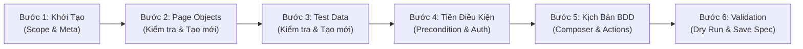

# 🧩 PLAN-05: STEP-BY-STEP SCRIPT STUDIO WIZARD
## Hướng Dẫn Quy Trình Tạo & Chỉnh Sửa Kịch Bản Theo Thứ Tự Phụ Thuộc (Dependency-First Testing Workflow)

> **Tài liệu phân tích nghiệp vụ (BA) & Thiết kế trải nghiệm người dùng (UI/UX)**  
> **Dự án**: Vieclam24h Playwright Automation Framework  
> **Tác giả**: Senior Product Owner / Senior Business Analyst & Senior Web/Mobile UI/UX Lead  
> **Trạng thái**: Draft - Chờ User Review & Phê duyệt

---

## 1. Bối Cảnh Nghiệp Vụ & Bài Toán Cần Giải Quyết (Problem Statement)

### 1.1. Hiện trạng (As-Is)
Hiện nay trên Dashboard (Tab **Kịch bản test BDD**), người dùng có thể tạo kịch bản mới hoặc sửa kịch bản hiện có. Tuy nhiên:
- **Thiếu thứ tự phụ thuộc (Missing Dependency Flow)**: Người dùng thường bắt đầu ngay bằng việc gõ nội dung các bước BDD (`Given`, `When`, `Then`) mà chưa có sự chuẩn bị về hạ tầng:
  - Chưa xác định kịch bản tương tác với những trang nào ➔ Chưa biết **Page Object** tương ứng đã tồn tại hay chưa.
  - Chưa biết kịch bản cần nạp dữ liệu gì ➔ Dẫn đến xu hướng **hard-code dữ liệu** trực tiếp vào kịch bản (vi phạm Mục 3 của `AI_PROMPTS.md`).
  - Chưa cấu hình rõ trạng thái đăng nhập/tiền điều kiện ban đầu ➔ Dẫn đến bước `Given` rỗng hoặc thiếu assertion/evidence.
- **Rời rạc giữa các Module**: Khi phát hiện thiếu một Page Object hoặc thiếu file JSON dữ liệu, người dùng phải thoát ra, chuyển sang tab khác hoặc tự tạo file thủ công ngoài IDE, gây đứt đoạn luồng suy nghĩ (broken user flow).
- **Chế độ Chỉnh sửa kịch bản hiện tại**: Chỉ cho phép chỉnh sửa danh sách các bước dạng text/code, không trực quan hóa được các file phụ thuộc (Dependencies: Page Objects liên quan, Test Data JSON liên quan).

### 1.2. Mục tiêu giải pháp (To-Be Vision)
Chuyển đổi module tạo/chỉnh sửa kịch bản thành **"Guided Script Studio Wizard"** - một quy trình từng bước (Step-by-Step) có định hướng, bảo đảm nguyên tắc **Dependency-First**:

- **Nguyên tắc "Cái gì có trước làm trước"**:
   1. Chọn platform trước, sau đó chỉ hiển thị Page Object tương thích với platform.
   2. Chỉ cho chọn Page Object đã có fixture hợp lệ. Page Object mới phải được đăng ký fixture hoặc được dùng qua factory trước khi đưa vào spec.
   3. Dataset được chọn phải có file hợp lệ và action phải tham chiếu tới một `dataPath` cụ thể; không coi việc import file là đã sử dụng dữ liệu.
   4. Mọi action BDD phải là structured action (`page`, `action`, `params`, `dataPath`, `evidence`), sau đó dùng chung compiler với Visual Step Builder hiện có.
   5. Backend phải validate và chạy `node --check` trên nội dung tạm trước khi ghi file.

### 1.3. Model dữ liệu chuẩn của Wizard
Wizard không lưu trạng thái bằng các đoạn code rời rạc. State tối thiểu phải có dạng:
```js
{
   platform: 'desktop',
   fileName: 'apply_job_flow-bdd.spec.js',
   featureName: 'Ứng tuyển việc làm',
   scenarioName: 'Người dùng ứng tuyển thành công',
   tags: ['@e2e'],
   timeoutMs: 240000,
   precondition: { auth: 'authenticated', landingPath: '/', closeOnboarding: true, verifyLandingPage: true, captureInitial: true },
   pageObjects: ['pages/desktop/HomePage.js'],
   dataSources: [{ file: 'data/applyJobData.json', variable: 'applyData' }],
   steps: [{ stepType: 'When', pageObject: 'pages/desktop/HomePage.js', actionId: 'open_nocv_job_list', params: {}, dataPath: null, title: 'Mở danh sách việc làm không cần CV', evidence: true }]
}
```
State là nguồn duy nhất để preview, compile và save; không dùng code preview làm nguồn dữ liệu ngược lại.

---

## 2. Chi Tiết Các Bước Nghiệp Vụ (User Journey & Step-by-Step Specification)

### 🔹 BƯỚC 1: Định Nghĩa Thông Tin & Phạm Vi Kịch Bản (Scenario Scope & Metadata)
- **Mục tiêu**: Xác định mục đích kiểm thử, nền tảng và bộ phân loại (Tags).
- **Trường thông tin**:
  - **Tên Kịch Bản (Tiếng Việt)**: Ví dụ: `Người dùng ứng tuyển việc làm không cần CV bằng OTP`.
  - **Feature Name**: Ví dụ: `Feature: Ứng tuyển việc làm nhanh @applyjob @e2e`.
  - **Platform**: `Desktop Web` hoặc `Mobile Web` (tự động điều hướng cấu hình viewport và fixture tương ứng).
  - **Bộ Tag / Test Suite**: Checkbox chọn nhanh `@smoke`, `@e2e`, `@regression`, `@profile`, `@applyjob`, `@auth`.
  - **Timeout & Tùy chọn thực thi**: Mặc định `test.slow()`, timeout 120s / 360s / 600s.

---

### 🔹 BƯỚC 2: Phân Tích & Chuẩn Bị Page Objects (Page Object Pre-requisites)
- **Mục tiêu**: Đảm bảo tất cả các trang web mà kịch bản đi qua đã có sẵn Page Object tương ứng trong thư mục `pages/`.
- **Cơ chế hoạt động**:
   1. Hệ thống dùng API Object Repository hiện có để liệt kê Page Object, method, locator, platform và fixture khả dụng.
   2. Chỉ Page Object cùng platform với kịch bản được chọn; `BasePage` và popup chỉ được chọn nếu compiler biết cách cung cấp chúng.
   3. Người dùng chọn Page Object sẽ sử dụng trong từng action, không chỉ tick một danh sách rời rạc.
   4. **Trường hợp Page Object chưa tồn tại**:
       - Hiển thị nút bấm nổi bật: `[+ Tạo Page Object Mới]`.
       - Nhấn vào sẽ mở một **Slide-out Drawer (hoặc Sub-panel)** ngay tại chỗ:
          - Tên Class: Ví dụ `CompanyReviewPage`.
          - URL tương đối: `/danh-gia-cong-ty.html`.
          - Danh sách locator ban đầu: Nhập tên phần tử và selector.
          - Bấm **"Tạo & Đưa Vào Kịch Bản"**: Hệ thống gọi API Object Repository hiện có để sinh file `pages/desktop/CompanyReviewPage.js` và đưa vào trạng thái draft.
          - Việc đăng ký fixture phải là một bước riêng, có kiểm tra import, backup và xác nhận fixture name. Nếu chưa đăng ký thành công thì Page Object mang trạng thái `created-but-not-available` và không được dùng để compile spec.
   5. Khi người dùng đổi platform, phải cảnh báo và loại các Page Object không tương thích khỏi state hoặc yêu cầu chọn lại.

---

### 🔹 BƯỚC 3: Phân Tích & Chuẩn Bị Test Data (Test Data Pre-requisites)
- **Mục tiêu**: Đảm bảo dữ liệu kiểm thử được tổ chức sạch sẽ tại thư mục `data/`, ngăn chặn hoàn toàn việc hard-code dữ liệu trong file spec.
- **Cơ chế hoạt động**:
   1. Người dùng chọn nguồn dữ liệu:
       - **Tùy chọn A**: *Sử dụng bộ dữ liệu có sẵn*: Dropdown chọn file JSON hiện có (`users.json`, `applyJobData.json`, `userProfileData.json`, v.v.). Hệ thống cho phép preview cấu trúc key-value và chọn `dataPath`.
       - **Tùy chọn B**: *Tạo bộ dữ liệu mới*: Nhấn `[+ Tạo File Test Data Mới]`.
  2. **Trường hợp tạo file data mới**:
     - Mở Drawer nhập tên file (ví dụ `companyReviewData.json`).
     - Hỗ trợ Form nhập nhanh hoặc JSON Editor có kiểm tra cú pháp (linting).
     - Hệ thống tự động lưu vào thư mục `data/`, backup nếu file đã tồn tại, tạo variable name hợp lệ và map import cùng `dataPath` vào action.
  3. Không hiển thị hoặc ghi log các giá trị nhạy cảm như password, OTP, token; preview phải mask các key nhạy cảm.
  4. Nếu người dùng hủy Wizard sau khi tạo dataset, phải có lựa chọn xóa/hoàn tác artifact draft; không âm thầm để lại file mồ côi.

---

### 🔹 BƯỚC 4: Thiết Lập Tiền Điều Kiện (Precondition & Initial State Setup)
- **Mục tiêu**: Chuẩn hóa 100% quy tắc Precondition theo Section 4 của `AI_PROMPTS.md`.
- **Cấu hình trực quan**:
  1. **Trạng thái tài khoản (Authentication)**:
     - `Đã đăng nhập (authenticatedUser)` ➔ Tự động chọn tài khoản test trong `users.json`, kích hoạt fixture đăng nhập tự động.
       - `Chưa đăng nhập (Khách vãng lai / Guest)` ➔ Không thêm fixture `authenticatedUser`, đồng thời gắn annotation `testInfo.annotations.push({ type: 'Precondition', description: 'Chưa đăng nhập (Khách vãng lai)' })`.
  2. **Trang xuất phát (Landing Page)**:
       - Dropdown chọn trang bắt đầu (Trang chủ `/`, Trang tìm việc `/viec-lam`, Trang hồ sơ `/ho-so-cua-toi.html`); compiler phải sinh `page.goto()` hoặc method Page Object tương ứng.
  3. **Xử lý rào cản ban đầu (Popup Handlers)**:
     - Checkbox: `[x] Đóng modal Onboarding nếu hiển thị` (`onboardingPopup.closeIfVisible()`).
     - Checkbox: `[x] Đóng popup quảng cáo / Mobile app banner nếu hiển thị`.
  4. **Kiểm tra & Chụp ảnh ban đầu (Assertion & Initial Evidence)**:
     - Tự động sinh lệnh kiểm tra hiển thị (ví dụ `homePage.expectHomepageVisible()`).
     - Tự động sinh lệnh chụp ảnh bằng chứng ban đầu: `homePage.capture('precondition_initial_state')`.

---

### 🔹 BƯỚC 5: Xây Dựng Kịch Bản BDD (Scenario Steps Composer)
- **Mục tiêu**: Soạn thảo các bước thực thi nghiệp vụ thông qua giao diện khối trực quan gắn kết với Page Object đã chọn ở Bước 2.
- **Tính năng**:
  - Thêm bước linh hoạt: `When` (Hành động người dùng), `And` (Hành động kế tiếp), `Then` (Kiểm tra kết quả mong đợi).
   - Với mỗi bước, hệ thống hỗ trợ **Smart Action Picker (Gợi ý hành động thông minh)** dùng metadata từ Object Repository và `PRESET_ACTIONS` hiện có:
      - Chọn Page Object tương ứng (được lọc từ Bước 2) và một method/locator hợp lệ.
      - Chọn tham số từ dataset bằng `dataPath` (ví dụ `applyData.noCVApply.job1`); không sinh literal dữ liệu nghiệp vụ vào spec.
      - Checkbox: `[x] Chụp ảnh bằng chứng (Capture evidence)` kèm tên screenshot được chuẩn hóa và kiểm tra ký tự hợp lệ.
      - Action không đủ fixture, method hoặc tham số phải bị đánh dấu lỗi và chặn sang Bước 6.
  - Hỗ trợ kéo thả đổi thứ tự bước, nhân bản bước, hoặc xóa bước.

---

### 🔹 BƯỚC 6: Review, Validation & Lưu Trữ (Compilation & Dry Run)
- **Mục tiêu**: Đảm bảo code sinh ra chuẩn cú pháp, sạch sẽ, không lỗi trước khi lưu vào disk.
- **Tính năng**:
  - **Split View thời gian thực**: Cột bên trái là danh sách các bước dạng Visual Card; Cột bên phải là Code Playwright Spec `.js` được sinh động thời gian thực.
   - **Nút "Kiểm tra cú pháp (Validate Syntax)"**: Gửi structured state lên backend; backend compile vào file tạm, chạy `node --check` và trả lỗi theo bước.
   - **Nút "Lưu kịch bản (Save Spec)"**: Backend kiểm tra filename an toàn, compile lại từ state, tạo backup và ghi file theo cơ chế atomic vào `tests/e2e/<platform>/<slug>.spec.js`.
   - **Nút "▶️ Chạy thử ngay (Dry Run)"**: Chỉ khả dụng sau validation; chạy file đã lưu hoặc file tạm theo lựa chọn rõ ràng, project đúng platform, có trạng thái process, exit code, timeout, stop và log SSE.
   - Spec thủ công không có metadata compiler hoặc không parse round-trip an toàn phải chuyển sang direct code edit/read-only dependency view, không tự động ghi đè toàn bộ step blocks.

---

## 3. Thiết Kế Giao Diện UI/UX (Senior Designer Specification)

### 3.1. Ngôn ngữ thiết kế & Thẩm mỹ
- **Phong cách**: Pro-Developer Tool (Linear / Vercel Dark & Light Theme), tinh tế, tối giản, sang trọng.
- **Tối ưu không gian dọc**: Header thanh gọn (`16px 14px` padding), typography chuẩn mực (`24px - 26px`), không chiếm dụng diện tích làm việc.

### 3.2. Stepper Header Component (Thanh Tiến Trình 6 Bước)
```text
┌──────────────────────────────────────────────────────────────────────────────────────────────────────────────────┐
│  [✓ 1. Thông tin] ─── [✓ 2. Page Objects] ─── [● 3. Test Data] ─── [○ 4. Tiền điều kiện] ─── [○ 5. BDD] ─── [○ 6. Lưu] │
└──────────────────────────────────────────────────────────────────────────────────────────────────────────────────┘
```
- **Completed Step**: Icon tick tròn xanh ngọc (`#10b981`), font chữ đậm vừa.
- **Active Step**: Viền sáng indigo (`#6366f1`), chấm tròn phát sáng nhẹ (pulsating dot), nền xám sáng thanh lịch.
- **Upcoming Step**: Màu xám nhẹ (`#94a3b8`), số thứ tự trong vòng tròn mờ.

### 3.3. Wireframe Khối Làm Việc 3 Cột

```text
┌────────────────────────┬──────────────────────────────────────────┬──────────────────────────────────────────┐
│ 📁 DANH SÁCH SCRIPT    │ 🧩 STEPPER WIZARD (CỘT TRUNG TÂM)        │ 💻 CODE SPEC PREVIEW (CỘT PHẢI)          │
├────────────────────────┼──────────────────────────────────────────┼──────────────────────────────────────────┤
│ 🔍 Tìm kiếm script...  │ BƯỚC 2: CHỌN & KIỂM TRA PAGE OBJECTS     │ // tests/e2e/desktop/new_feature.spec.js │
│                        │                                          │ const { test } = require('...');         │
│ • apply_job_noCV.spec  │ Các Page Object cần cho kịch bản:        │                                          │
│ • complete_profile...  │ [✓] HomePage            (Đã có)          │ test.describe('Feature: ...', () => {    │
│ • guest_apply_job...   │ [✓] JobSearchPage       (Đã có)          │   test('...', async ({ homePage }) => {  │
│ • onboarding-bdd.spec  │ [ ] CompanyReviewPage   [+ Tạo mới]      │     testInfo.annotations.push(...);      │
│                        │                                          │     await test.step('Given ...', ...);   │
│ ────────────────────── │ ──────────────────────────────────────── │   });                                    │
│ [+ Tạo kịch bản mới]   │ ┌──────────────────────────────────────┐ │ });                                      │
│                        │ │ 💡 Gợi ý: Chưa có CompanyReviewPage. │ │                                          │
│                        │ │ Bấm nút Tạo mới để sinh mã Page mẫu. │ │ ──────────────────────────────────────── │
│                        │ └──────────────────────────────────────┘ │ [💾 Lưu kịch bản]   [▶️ Chạy thử ngay]   │
│                        │ [< Quay lại]            [Tiếp theo >]    │                                          │
└────────────────────────┴──────────────────────────────────────────┴──────────────────────────────────────────┘
```

---

## 4. Tác Động & Kế Hoạch Triển Khai Kỹ Thuật (Architecture & Components)

### 4.1. Các thành phần Frontend (`dashboard/public/`)
1. **`dashboard/public/index.html`**:
   - Tích hợp markup Stepper Navigation (`#script-wizard-stepper`) trong view `#script-create-view`.
   - Bổ sung Drawer tạo nhanh Page Object (`#drawer-create-page-object`) và Drawer tạo Test Data (`#drawer-create-test-data`).
2. **`dashboard/public/styles.css`**:
   - Thêm bộ CSS tokens cho Stepper: `.stepper-bar`, `.stepper-item`, `.stepper-item.active`, `.stepper-item.completed`.
   - Thêm style cho Dependency Status Cards: `.dependency-card`, `.dependency-badge-ready`, `.dependency-badge-missing`.
   - Tối ưu Drawer trượt từ cạnh phải mượt mà không làm vỡ layout 3 cột.
3. **`dashboard/public/app.js`**:
   - Module `ScriptWizardController`: Quản lý một structured state duy nhất, validation từng bước, dirty state, lưu nháp và bảo vệ khi rời Wizard.
   - Module `DependencyInspector`: Dùng `/api/object-repository/pages`, `/api/object-repository/page` và `/api/data/datasets` hiện có; không tạo API song song chỉ để scan lại thư mục.
   - Module `SpecCompiler`: Gọi compiler dùng chung với Visual Step Builder; frontend chỉ preview, không phải nguồn compile tin cậy.
   - Dùng shared code editor hiện có cho spec preview/edit, không tạo thêm editor textarea và CSS riêng.

### 4.2. Các API Backend (`dashboard/server.js`)
1. **Tái sử dụng** `GET /api/object-repository/pages`, `GET /api/object-repository/page` và `GET /api/data/datasets` để đọc dependency.
2. **Tái sử dụng** `POST /api/object-repository/create-page` và `POST /api/data/create-dataset`; bổ sung draft/undo nếu cần để tránh file mồ côi.
3. **Mở rộng** `POST /api/builder/compile` để nhận structured Wizard state và trả `warnings/errors`, `requiredFixtures`, `specRelativePath` và `specCode`.
4. **Bổ sung** `POST /api/builder/validate-spec`: compile vào file tạm, chạy `node --check`, không ghi source file và không thực thi test.
5. **Mở rộng** `POST /api/builder/save` để validate lại ở backend, kiểm tra path whitelist, backup và atomic write.
6. **Dry Run** dùng cơ chế runner/SSE hiện có; không spawn một process không có cơ chế stop, timeout và chống chạy trùng.

### 4.3. Ràng buộc an toàn và tính toàn vẹn
- Chỉ cho phép ghi trong `pages/<platform>`, `data/` và `tests/e2e/<platform>`; resolve path xong phải kiểm tra lại nằm trong root được phép.
- Filename, class name, variable name, tag và screenshot name phải qua whitelist; giá trị đưa vào JavaScript phải serialize an toàn bằng `JSON.stringify` hoặc AST-aware builder.
- Save theo thứ tự: validate state -> compile -> syntax check -> backup -> ghi file tạm cùng thư mục -> rename atomic -> refresh catalog.
- Nếu tạo nhiều artifact, phải trả transaction result từng artifact và có rollback/undo rõ ràng.
- Không coi `node --check` là kiểm tra runtime: fixture, import, method, data path và project mapping phải có validation riêng.

### 4.4. Quyết định kiến trúc bắt buộc
- **Fixture strategy**: MVP chỉ cho dùng các Page Object đã có fixture trong `baseTest.js` hoặc `mobileWebTest.js`. Việc tự động cập nhật fixture cho Page Object mới để ở phase 2, sau khi có cơ chế import validation và backup an toàn.
- **Compiler ownership**: `visualBuilderCompiler.js` là nguồn compile duy nhất. Wizard chỉ chuyển state về schema chung; không duy trì template compiler riêng trong `app.js`.
- **Edit ownership**: Spec có metadata `generator: visual-builder` được phép round-trip qua visual editor. Spec không có metadata chỉ được xem dependency và sửa bằng shared code editor.
- **Draft ownership**: Draft chỉ nằm ở client/local session cho tới khi người dùng Save. Dependency scaffold tạo sớm phải được đánh dấu và có thao tác Undo rõ ràng.

### 4.5. API contract tối thiểu
#### `POST /api/builder/compile`
Request body là Wizard state ở mục 1.3. Response thành công:
```json
{
   "valid": true,
   "specCode": "...",
   "specRelativePath": "tests/e2e/desktop/example-bdd.spec.js",
   "requiredFixtures": ["test", "homePage"],
   "warnings": [],
   "errors": []
}
```

Response lỗi vẫn trả `400` với `errors[]`, mỗi lỗi có `path`, `code`, `message`; không trả stack trace hoặc dữ liệu nhạy cảm.

#### `POST /api/builder/validate-spec`
- Nhận cùng state với compile.
- Không ghi file source, không tạo backup, không chạy test.
- Trả `valid`, `syntaxError`, `errors[]`, `warnings[]` và `compiledHash` để frontend biết preview đã được validate.

#### `POST /api/builder/save`
- Nhận state và tùy chọn `expectedHash` để tránh ghi đè thay đổi của phiên khác.
- Backend compile và validate lại, không tin `specCode` do client gửi.
- Response trả `specPath`, `backupPath`, `compiledHash`, `createdAt` và danh sách artifact đã ghi.
- Nếu một bước ghi thất bại, response phải nêu artifact nào đã rollback thành công và artifact nào cần xử lý thủ công.

### 4.6. State machine và hành vi lỗi
```text
EMPTY -> DRAFT -> DEPENDENCIES_READY -> COMPOSING -> VALIDATED -> SAVING -> SAVED
                         \-> BLOCKED_ERROR      \-> VALIDATION_ERROR
```
- Chỉ cho đi tới bước kế tiếp khi state hiện tại không có lỗi blocking.
- Có thể quay lại bước trước; khi thay đổi platform hoặc dependency phải invalidate các action liên quan.
- Refresh, đổi tab hoặc đóng trang khi dirty phải hiện cảnh báo; không tự động bỏ state.
- Lỗi network cho phép retry và giữ nguyên state local; lỗi conflict yêu cầu reload/compare trước khi save.

### 4.7. Phạm vi phát hành
- **MVP**: tạo spec từ dependency đã có, chọn preset/method/locator, map dataset, compile/validate/save, backup, inspect dependency và chạy desktop/mobile project tương ứng.
- **Phase 2**: scaffold Page Object kèm đăng ký fixture có kiểm thử import, draft/undo nhiều artifact, rollback đầy đủ và round-trip visual cho spec compiler-managed.
- **Phase 3**: Dry Run file tạm, conflict resolution nâng cao, action registry mở rộng và hỗ trợ nhiều scenario trong một feature.
- Không đưa tính năng Phase 2/3 vào acceptance của MVP nếu chưa có contract và test tương ứng.

### 4.8. Dependency gates trước khi triển khai
- **Gate 0 - Shared contract:** tạo schema module dùng chung tại `core/generator/wizardSchema.js` (hoặc tên được phê duyệt tương đương), có version, validator và fixture/action/data contract.
- **Gate 1 - PLAN-01:** `dataSource`, `dataPath`, secret masking và action/assertion registry đã có schema/test; dataset Drawer không làm mất `content`.
- **Gate 2 - PLAN-04A:** Object Repository trả được `platform`, `fixtureName`, method/locator và `readiness`; Page Object chưa pass readiness bị chặn.
- **Gate 3 - PLAN-02:** compiler dùng schema chung, output deterministic, validate fixture/method/data và backend save an toàn.
- **Gate 4 - Runner:** dry run/SSE/stop/timeout/report metadata dùng cùng runner contract hiện có.
- **Gate 5 - PLAN-05:** chỉ bắt đầu UI Wizard sau khi Gate 1-3 pass; PLAN-03 AI không phải dependency để tạo Wizard MVP.

### 4.9. Thứ tự cập nhật toàn bộ chương trình
`PLAN-01 Data/Action Contract -> PLAN-04A Object/Fixture Contract -> PLAN-02 Compiler/Save Contract -> PLAN-05 Wizard -> PLAN-03 Diagnostics/AI -> PLAN-04B Discord/GitHub Automation`

Trong mỗi phase phải có migration note cho artifact cũ và không phá vỡ API Dashboard hiện có. PLAN-05 không được tự tạo state/compiler/API riêng nếu Gate 0-3 chưa đạt.

Mỗi plan phải cập nhật trạng thái `Đã có`, `Gap`, `Cần sửa` và `Acceptance`; không dùng nhãn “hoàn thiện 10/10” nếu chưa có test regression tương ứng.

---

## 5. Bảng So Sánh Trước & Sau Khi Nâng Cấp

| Tiêu chí | Trước khi nâng cấp (As-Is) | Sau khi nâng cấp với Wizard (To-Be) |
| :--- | :--- | :--- |
| **Thứ tự thực hiện** | Nhảy ngay vào gõ bước BDD, không kiểm tra hạ tầng có trước. | Quy trình chuẩn 6 bước: Scope ➔ Page Objects ➔ Data ➔ Precondition ➔ BDD ➔ Save. |
| **Xử lý thiếu Page Object** | Lỗi runtime `is not a function` khi chạy test; phải mở IDE tạo thủ công. | Hệ thống cảnh báo ngay ở Bước 2 và cung cấp nút bấm tạo nhanh Page Object tại chỗ. |
| **Xử lý Test Data** | Hard-code dữ liệu trong file spec; phân tán dữ liệu. | Buộc liên kết hoặc tạo file JSON tại Bước 3, giữ code spec hoàn toàn độc lập với test data. |
| **Tiền điều kiện (Precondition)** | Dễ bị quên hoặc để bước `Given` rỗng 0ms. | Form Bước 4 tự động sinh `testInfo.annotations` và bước `Given` chuẩn có assertion & evidence. |
| **Trải nghiệm UI/UX** | Form dài đơn điệu, dễ gây ngợp. | Thanh Stepper trực quan, từng bước rõ ràng, sang trọng theo chuẩn pro developer tools. |

---

## 6. Kế Hoạch Kiểm Thử & Tiêu Chí Nghiệm Thu (Acceptance Criteria)

1. **AC-1 (Luồng tạo mới tuần tự)**: Người dùng có thể đi qua đầy đủ 6 bước của Wizard, mỗi bước có kiểm tra tính hợp lệ trước khi cho phép bấm "Tiếp theo".
2. **AC-2 (Dependency contract)**: Page Object chỉ được chọn khi cùng platform và có fixture/method hợp lệ; Page Object mới chưa đăng ký fixture bị chặn khỏi compile.
3. **AC-3 (Data contract)**: Dataset tồn tại, JSON hợp lệ, data path tồn tại và action dùng đúng variable/path; preview không làm lộ password, OTP hoặc token.
4. **AC-4 (Compiler contract)**: Cùng một structured state tạo ra output deterministic, có Precondition annotation, Given assertion/evidence theo cấu hình, action thật trong `test.step`, không hard-code dữ liệu nghiệp vụ.
5. **AC-5 (Validation and save)**: `node --check` chạy ở backend trước khi lưu; path traversal, filename không hợp lệ, fixture thiếu và method không tồn tại đều bị từ chối; file cũ có backup và save lỗi không tạo file một phần.
6. **AC-6 (Edit safety)**: Spec do compiler quản lý được round-trip; spec thủ công/custom code được nhận diện và không bị overwrite ngoài ý muốn. Hủy Wizard không để lại artifact ngoài ý muốn.
7. **AC-7 (Dry Run)**: Chỉ chạy sau validation, đúng project/platform, có live log, stop, timeout, exit code và không chạy đồng thời trái phép.
8. **AC-8 (Regression/UI)**: Giữ nguyên API và hành vi Dashboard hiện có; dùng shared layout/editor; kiểm tra light/dark, 1920x1080, 1440x900, 1280px và mobile viewport.

### 6.1. Bộ kiểm thử tối thiểu
- Unit test cho state validation, filename/path whitelist, data path resolution và compiler output.
- API test cho compile, validate, save, scaffold success/failure, backup, rollback và path traversal.
- Fixture/import test cho desktop và mobile, bao gồm Page Object mới.
- UI test cho chuyển bước, đổi platform, dirty state, refresh, hủy Wizard, keyboard save và lỗi validation.
- Smoke test dry run với một spec nhỏ, kiểm tra SSE, stop, timeout và exit code.

### 6.2. Definition of Done
- Có schema/version cho Wizard state và test reject state không hợp lệ.
- Compiler dùng chung được gọi từ backend; frontend không thể tự quyết định nội dung save.
- Desktop và mobile đều được kiểm tra fixture/import/method mapping.
- Save không ghi đè khi `expectedHash` không khớp; backup và rollback được kiểm tra bằng test.
- Không còn route hoặc template trùng chức năng với Object Repository, Data Manager và Visual Builder hiện có.
- Có kiểm tra console error, duplicate listener, dirty-state loss và responsive ở các viewport đã nêu.
- Tài liệu API, migration note và giới hạn spec thủ công được cập nhật cùng implementation.
